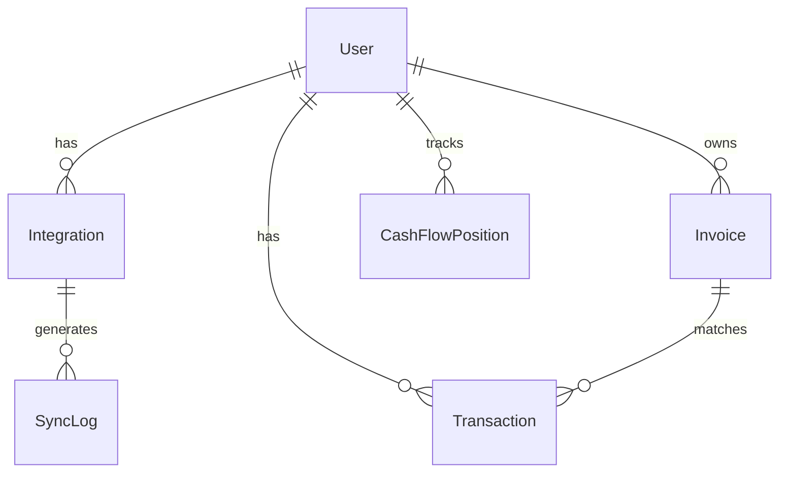

# System architecture documentation

## Design, technical planning and architecture

The current design, technical planning, and architectural documentation should be viewed as a thoughtful but flexible starting point rather than a rigid blueprint.

While we've carefully considered our initial technical choices and system design based on current requirements and constraints, we fully expect this architecture to evolve as we begin building and learning from real-world usage.

The true value of this documentation lies not in its prescriptive details, but in providing a clear foundation that enables our team to start development with confidence while maintaining the agility to adapt.

As we build the MVP, we'll inevitably discover new challenges, gather user feedback, and gain insights that will reshape our understanding of both technical and business needs. This might lead us to refine our API design, adjust our data models, or even reconsider some of our initial technology choices.

## Core problem definition

Billify's fundamental purpose is to give SMEs a clear, real-time view of their cash flow position. The main pain points are:

- fragmented financial data across multiple systems
- difficulty in predicting and controlling cash flow
- time-consuming manual processes
- complex existing solutions requiring accounting expertise

## System architecture

## Database relationships

## Key constraints & scope reductions

### User base constraints
- initial target: 10 users
- maximum MVP scale: ~100 users
- geographic constraint: Belgium only
- business hours only (9AM-5PM)
- web platform only (defer mobile)

### Integration constraints
- limit to only 2 critical integrations for MVP:
  - Yuki (accounting data)
  - Ponto (banking data)
- defer other integrations (Exact, Billit, Silverfin) to post-MVP
- simple polling-based sync (1-minute intervals) instead of real-time
- read-only integration (no write-back to source systems)

### Technical stack

#### Frontend
- single-page application using React
- Tailwind CSS for styling
- basic charting with Recharts
- no mobile optimisation needed

#### Backend
- Django (Python) monolith
- REST APIs for frontend communication
- basic scheduled tasks with Celery
- simple polling-based integration sync

#### Database
- single PostgreSQL database
- Digital Ocean managed hosting
- basic object storage for documents
- no need for complex caching initially

#### Infrastructure
- Digital Ocean basic droplet
- managed PostgreSQL
- single region (EU)
- simple SSL/TLS security

#### Monitoring
- basic error logging
- simple uptime monitoring
- essential security logging
- basic performance metrics

## System requirements

### Web server requirements (10 users)
- memory: 400MB RAM
  - Django + dependencies: 200MB
  - Celery: 100MB
  - sync processes: 100MB
- CPU: single threaded (1 vCPU)
- storage: 2GB monthly
  - Django app + dependencies: 500MB
  - logs: 1GB/month
- network: 4GB monthly
  - API sync payload: 100KB/sync → 144MB/day → 4GB/month

### Database server requirements
- memory: 1GB RAM
  - base PostgreSQL: 100MB
  - connections (10MB × 10): 100MB
  - shared buffers: 256MB
  - working memory: 64MB
- storage: 1GB/month
  - database records: 300MB/month
  - system needs: 700MB
    - PostgreSQL installation: 100MB
    - WAL logs: 500MB
    - indexes: 100MB/month

## Data models

The system uses several core entities to manage financial data and integrations:
- user: stores authentication and company information
- integration: manages external system connections and sync state
- invoice: tracks incoming and outgoing invoices
- transaction: records actual money movements
- cash flow position: represents point-in-time financial snapshots
- sync log: monitors integration health and sync status

## Layered architecture

The system follows a layered architecture pattern to separate concerns and maintain flexibility:
- presentation layer: handles user interface and API endpoints
- application layer: coordinates business processes
- domain layer: contains core business logic
- integration layer: manages external system interactions
- data layer: handles persistence and data access

## Failure points

### Web server failure
- **impact**: application becomes completely inaccessible to users
- **mitigation**:
  - load balancer with multiple web server instances
  - server monitoring with outage alerts
  - auto-restart scripts

### File storage service failure
- **impact**: users cannot upload or access stored files
- **mitigation**:
  - managed cloud storage (DigitalOcean Spaces/AWS S3)
  - file upload retry queue
  - local metadata caching

### Service queue node failure
- **impact**: delayed data syncs and report generation
- **mitigation**:
  - multiple queue nodes with failover
  - high-availability task broker (RabbitMQ/Redis)
  - task retries and dead-letter queues

### Database server failure
- **impact**: all data operations fail
- **mitigation**:
  - managed database with automatic failover
  - read replicas
  - regular backup testing
  - query retry logic

## Containerization strategy

For MVP development, we use Docker to ensure environment consistency across development, testing, and production. Docker simplifies dependency management and deployment while maintaining scaling flexibility.

Kubernetes is intentionally excluded at this stage due to:
- unnecessary operational complexity for single-developer MVP
- no immediate need for advanced container orchestration
- focus on rapid iteration and value delivery

## Batch vs event-driven architecture

### Batch sync advantages
- simple implementation and debugging
- predictable resource usage
- 30-60 second delay acceptable for SME use case
- easy monitoring and error handling

### Event-driven requirements (deferred)
- message queue system
- event store
- complex retry mechanisms
- webhook endpoints
- event validation/ordering
- deduplication logic

### Cost-benefit analysis

**Batch sync (30s/1min)**
- ✅ simple implementation
- ✅ easy maintenance
- ✅ negligible resource usage
- ✅ sufficient timeliness
- ✅ simple error handling
- ✅ simple monitoring
- ❌ small data freshness delay

**Event-driven**
- ✅ real-time updates
- ❌ complex implementation
- ❌ complex maintenance
- ❌ more infrastructure
- ❌ more points of failure
- ❌ harder to debug
- ❌ higher development cost

For MVP, batch synchronization provides the best balance of functionality and implementation complexity.