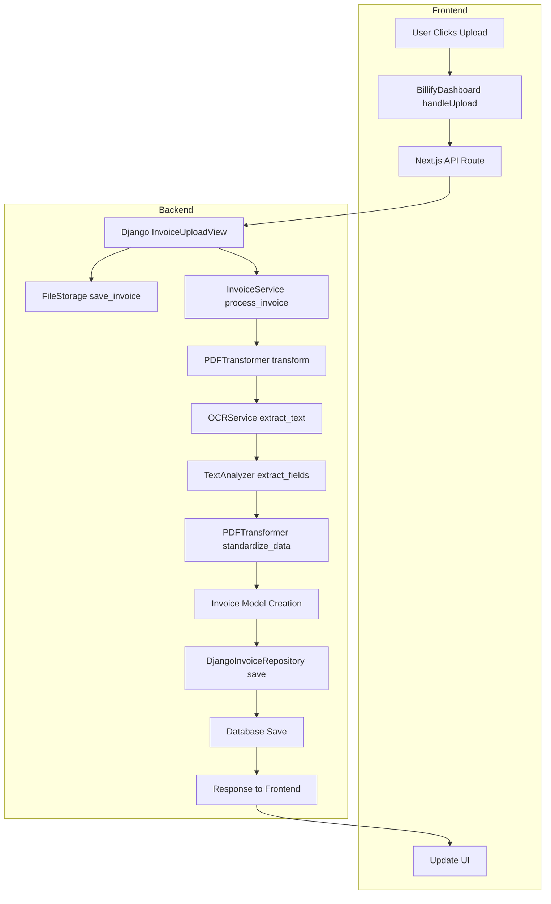

# Invoice Upload Flow Documentation

## Overview

The invoice upload process in Billify is a sophisticated multi-stage pipeline that transforms a PDF invoice into structured data while maintaining data integrity and providing real-time feedback to users. This document explains how the system processes invoices, from the moment a user clicks the upload button to the final database storage and UI confirmation.

## System Architecture Flow

## Detailed Process Breakdown

### 1. Frontend Initiation

When a user interacts with Billify's invoice upload feature, the process begins in the React frontend:

- **Component**: `frontend/app/dashboard/page.tsx`
- **Key Function**: `handleUpload`
- **Responsibility**: Captures the PDF file and prepares it for transmission

The frontend creates a FormData object containing the PDF file and sends it through a secure channel to the backend. This approach ensures efficient handling of binary file data while maintaining a responsive user interface.

### 2. API Layer Processing

The request moves through our API middleware layer:

- **Component**: `frontend/app/api/invoices/upload/route.ts`
- **Key Function**: `POST`
- **Responsibility**: Routes the file to Django backend and handles communication

This layer acts as a bridge between our frontend and backend systems, ensuring proper error handling and response formatting.

### 3. Backend Processing Pipeline

#### Initial Request Handling
- **Component**: `backend/api/views/invoice.py`
- **Class**: `InvoiceUploadView`
- **Responsibility**: Orchestrates the complete invoice processing workflow

The view layer validates incoming requests and coordinates the various processing stages, ensuring each step is properly executed and monitored.

#### File Storage
- **Component**: `backend/infrastructure/storage/file_system.py`
- **Class**: `FileStorage`
- **Responsibility**: Securely stores uploaded files with proper organization

The storage system creates a structured directory hierarchy and generates unique filenames to prevent collisions.

#### Business Logic Processing
- **Component**: `backend/domain/services/invoice_service.py`
- **Class**: `InvoiceService`
- **Responsibility**: Coordinates the business rules and processing flow

This service layer ensures all business rules are applied consistently and manages the overall processing workflow.

#### PDF Processing and Data Extraction
- **Component**: `backend/integrations/transformers/pdf/transformer.py`
- **Class**: `PDFTransformer`
- **Responsibility**: Manages PDF data extraction and transformation

The transformation process includes several specialized components:

1. **OCR Processing**
   - **Component**: `backend/integrations/transformers/pdf/ocr.py`
   - **Class**: `OCRService`
   - **Responsibility**: Converts PDF content to machine-readable text

2. **Text Analysis**
   - **Component**: `backend/integrations/transformers/pdf/text_analysis.py`
   - **Class**: `TextAnalyzer`
   - **Responsibility**: Extracts structured data from raw text

#### Data Persistence
- **Component**: `backend/domain/models/invoice.py`
- **Class**: `Invoice`
- **Responsibility**: Defines the domain model for invoices

The persistence layer ensures data integrity and proper storage:

- **Component**: `backend/infrastructure/django/repositories/invoice_repository.py`
- **Class**: `DjangoInvoiceRepository`
- **Responsibility**: Handles database operations and data mapping

## Error Handling and Validation

The system implements comprehensive error handling at multiple levels:

1. Frontend validation ensures proper file types and sizes
2. API layer catches transmission and format errors
3. Backend processing includes:
   - File validation
   - OCR error handling
   - Data extraction validation
   - Database constraint checking

## Performance Considerations

The invoice upload system is designed with several performance optimizations:

1. Asynchronous file processing to maintain UI responsiveness
2. Efficient file storage with proper indexing
3. Optimized OCR processing with error recovery
4. Database operation batching where appropriate

## Future Enhancements

Planned improvements to the invoice upload system include:

1. Enhanced OCR accuracy through machine learning
2. Support for additional invoice formats
3. Batch upload capabilities
4. Real-time processing status updates
5. Advanced validation rules customization

## Development Guidelines

When working with the invoice upload system, developers should:

1. Maintain separation of concerns between layers
2. Follow established error handling patterns
3. Add appropriate logging for debugging
4. Ensure proper test coverage for new features
5. Document any changes to the processing pipeline

## Testing

The invoice upload system includes several types of tests:

1. Unit tests for individual components
2. Integration tests for the complete pipeline
3. Performance tests for large files
4. Error handling tests for edge cases

Developers should run the full test suite before making any changes to the upload pipeline.