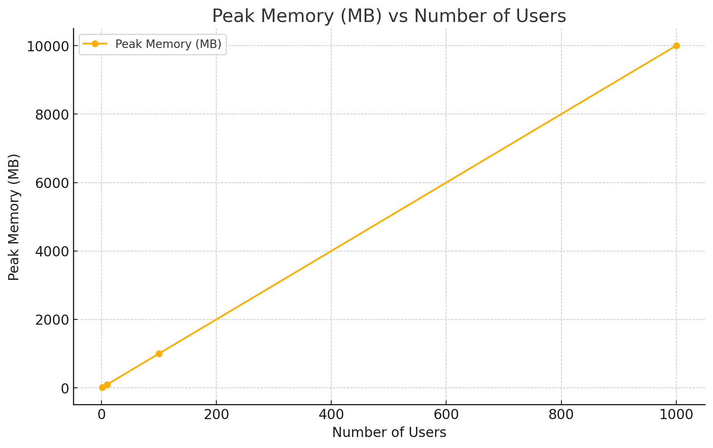
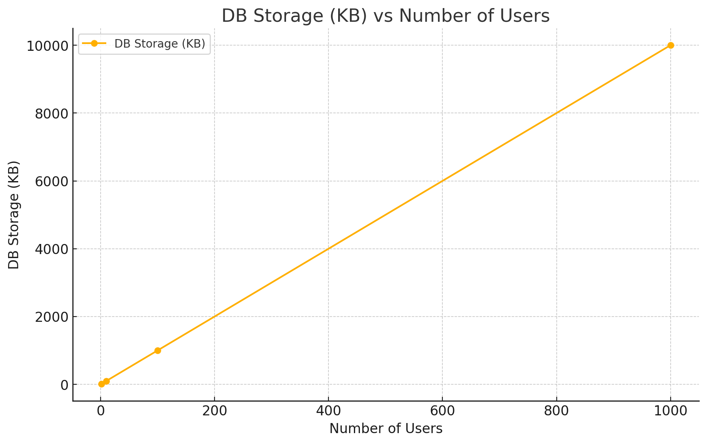
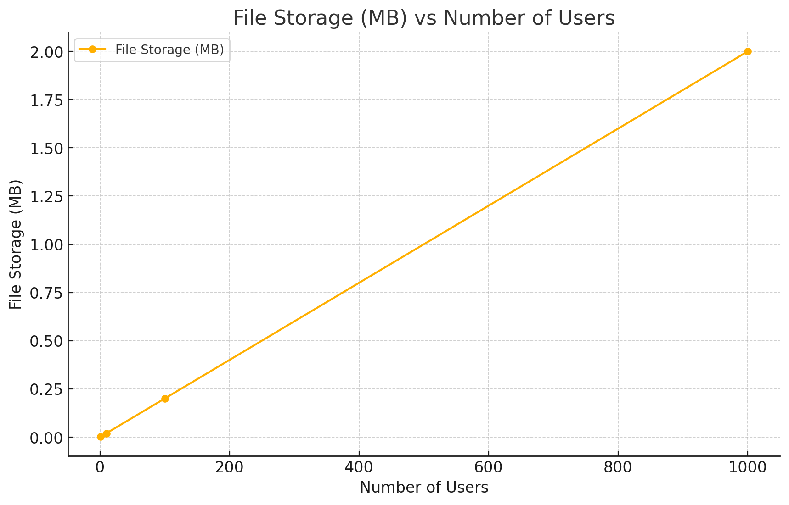
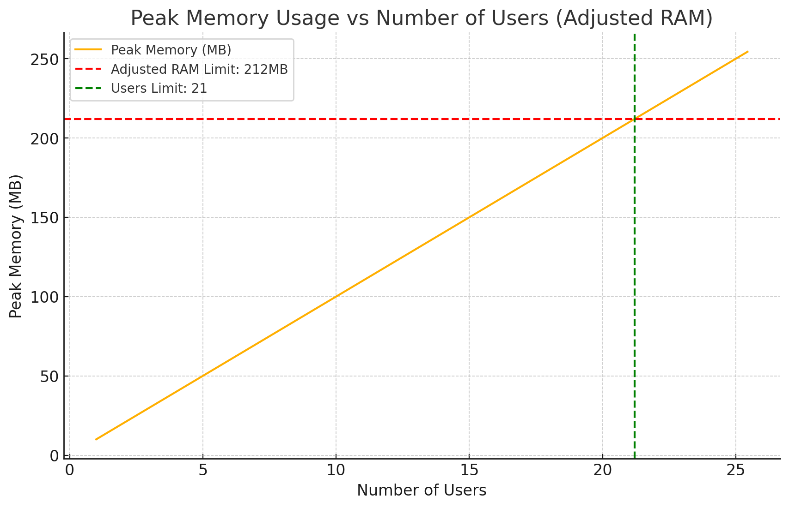
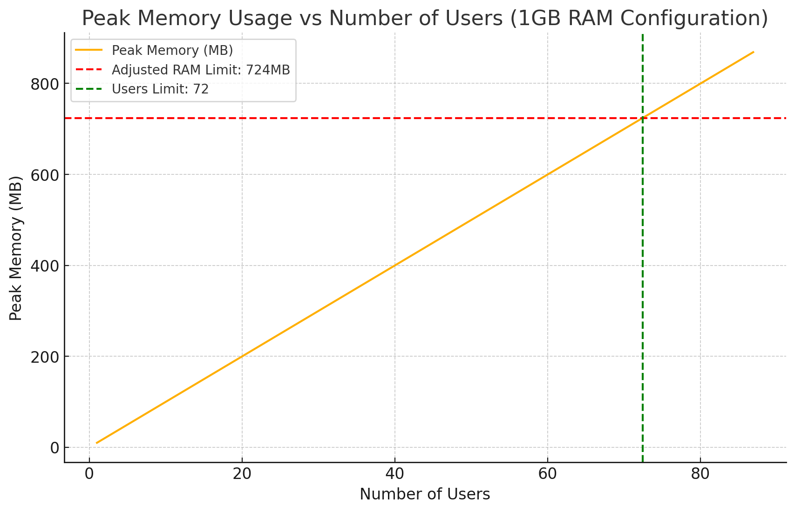
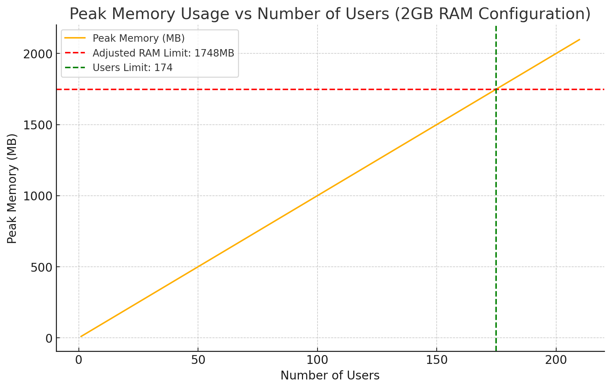
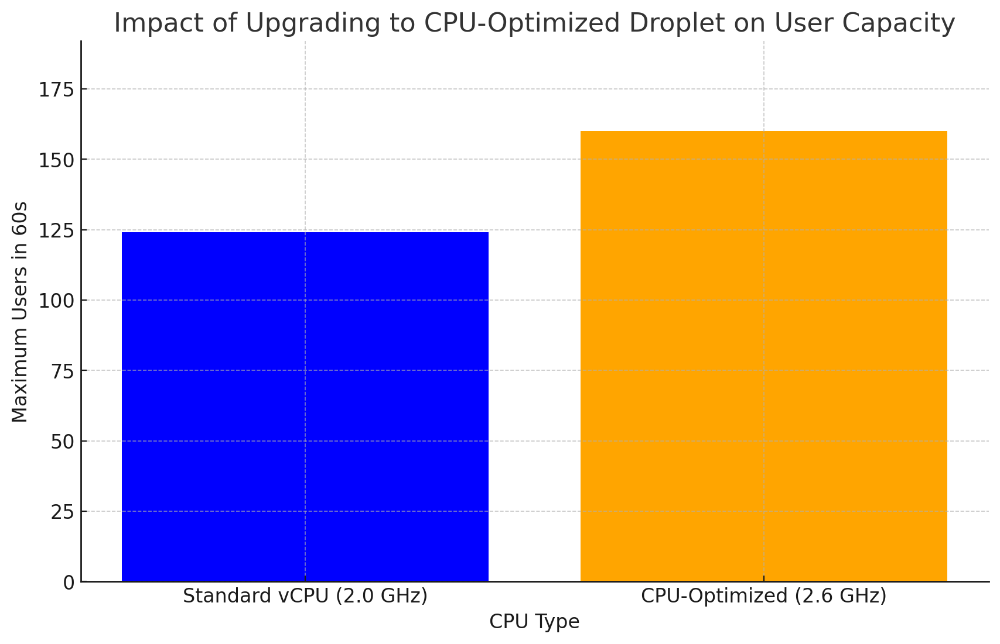
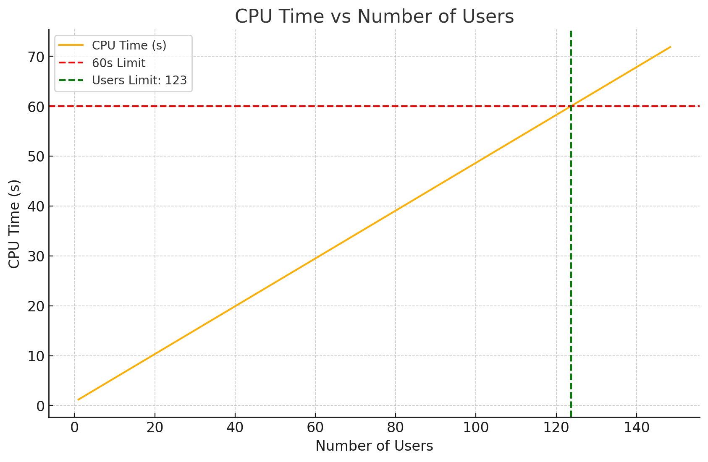

# Scalability

## Growth of users - batch syncing

### Server specifications (basic digital ocean droplet)
- 512MB RAM
- 1 virtual CPU, shared (500ms CPU processing time per user per sync)
- 500GB outbound data transfer/month
- 10GB SSD

### Per sync (every minute) assumptions
- 2 API calls (Yuki, Ponto)
- 5 database READ operations
- 10 database WRITE operations
- Unoptimised programming practices
- 500ms CPU processing time per user per sync (worst-case scenario)
 - Parse API responses
 - Process new records 
 - Update calculations
 - Database operations
- CPU processing time scales linearly with users (worst-case)
- 10MB memory usage during processing:
 - 50KB JSON API response temporarily in memory
 - 500KB parsed JSON data into Python objects
 - 5MB processing overhead
- Memory usage scales linearly with users (worst-case)
- 10kb database records per user:
 - Invoice record: ~1-2KB
 - Transaction record: ~0.5-1KB
 - Balance record: ~100 bytes
 - Sync log: ~200 bytes
- Database records scale linearly with users (worst-case)
- (2/1440) invoices per sync per user
- (1/1440) MB file size per invoice

### Usage metrics per number of users

#### Per sync
| Users | API calls | DB READ | DB WRITE | CPU time | CPU load | Peak memory | DB storage | File storage |
| --- | --- | --- | --- | --- | --- | --- | --- | --- |
| 1 | 2 | 5 | 10 | 500ms | 0.83% | 10MB | 10kb | 0.002MB |
| 10 | 2 | 5 | 10 | 5s | 8.3% | 100MB | 100kb | 0.02MB |  
| 100 | 2 | 5 | 10 | 50s | 83% | 1GB | 1MB | 0.2MB |
| 1000 | 2 | 5 | 10 | >8min | >100% | 10GB | 10MB | 2MB |

#### Per day (1440 syncs)
- 100 new DB records per user
- 2 invoices per user
- 1MB file size per invoice
- Memory freed after each sync

| User | API calls | DB READ | DB WRITE | CPU time | CPU load | Peak memory | DB storage | File storage |
| --- | --- | --- | --- | --- | --- | --- | --- | --- |
| 1 | 2880 | 7200 | 14400 | 12min | 0.83% | 10MB | 1MB | 2MB |
| 10 | 2880 | 7200 | 14400 | 2h | 8.3% | 100MB | 10MB | 20MB |
| 100 | 2880 | 7200 | 14400 | 20h | 83% | 1GB | 100MB | 200MB |
| 1000 | 2880 | 7200 | 14400 | 200h | >100% | 10GB | 1GB | 2GB |

#### Per month (30 days)
60 invoices per month per user

| Users | API calls | DB READ | DB WRITE | CPU time | CPU load | Peak memory | DB storage | File storage |
| --- | --- | --- | --- | --- | --- | --- | --- | --- |
| 1 | 86400 | 216000 | 432000 | 6h | 0.83% | 10MB | 30MB | 60MB |
| 10 | 86400 | 216000 | 432000 | 2.5d | 8.3% | 100MB | 300MB | 600MB |
| 100 | 86400 | 216000 | 432000 | 25d | 83% | 1GB | 3GB | 6GB |
| 1000 | 86400 | 216000 | 432000 | 250d | >100% | 10GB | 30GB | 60GB |

### Scaling limitations

#### RAM limitations
- With 212MB available RAM (512MB - 300MB for Django/Celery): Max 21 users

- With 724MB available RAM (1GB - 300MB for Django/Celery): Max 72 users

- With 1748MB available RAM (2GB - 300MB for Django/Celery): Max 175 users

#### CPU optimizations
- Increase clock speed to 2.6 GHz:
 - Reduces processing time from 500ms to 385ms per user
 - Increases capacity to 160 users (+36 users)
 - No code changes required

- At 500ms per user: Max 124 users within 60-second window

## Growth of integrations

### Integration abstraction layer
Must efficiently handle new integrations beyond initial Yuki and Ponto implementations through:

#### Standardised interface
Decouples core functionality from specific integrations:
- One codebase for integration logic
- Prevents integration cross-dependencies
- Simplifies bug fixes and feature updates
- Enables easy integration upgrades

#### Common data model
- Standardizes data formats across integrations
- Ensures consistent field presence and types
- Standardizes:
 - Invoices
 - Transactions
 - Balances

#### Centralized error handling
- Standardized error reporting
- Unified monitoring
- Consistent recovery procedures
- Components:
 - Error classification
 - Error logging
 - Recovery procedures

### Additional resource requirements
Each new integration adds:
1. API calls
2. Database operations
3. Memory usage
4. CPU time
5. Storage

## Other growth factors
- Analytics and forecasting: To be analyzed during development
- OCR: To be analyzed during development  
- Feature complexity: To be analyzed per feature