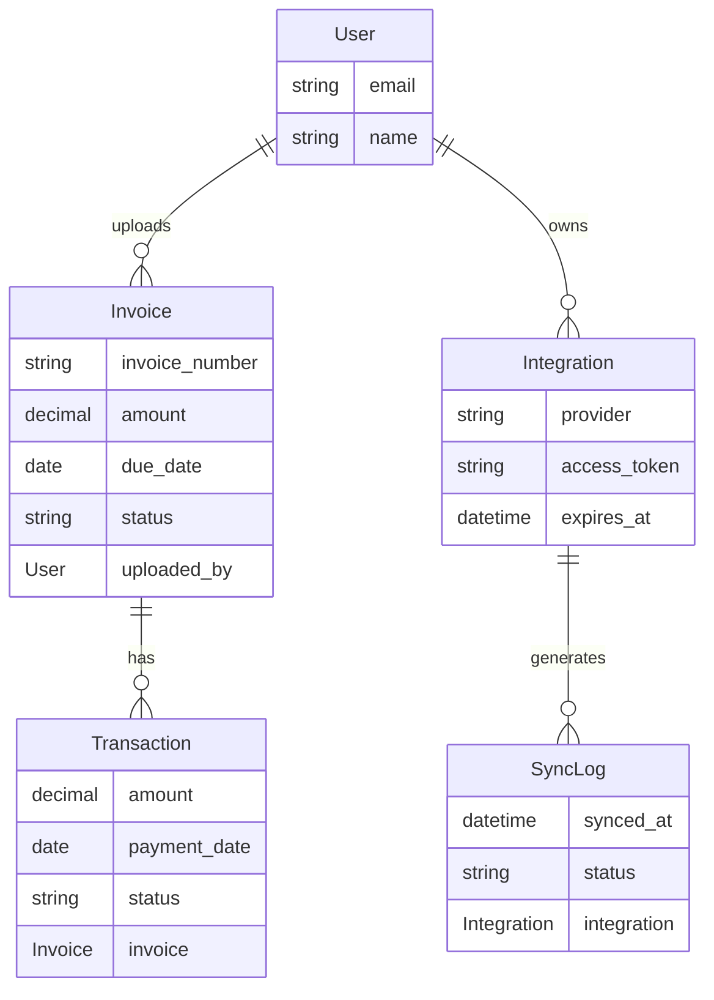

# Adr: choosing PostgreSQL over MongoDB for MVP

## Status
Accepted

## Context
During MVP planning, we considered whether to use MongoDB instead of PostgreSQL, with the key question being whether MongoDB would enable faster implementation and deployment.

Our MVP requirements show we need to handle:
- 10-100 users initially
- ~7,200 read operations per day (0.083 reads/second)
- ~14,400 write operations per day (0.167 writes/second)
- ~300MB storage per user per month
- Financial calculations and data relationships

For detailed analysis, see: [scalability requirements](../../design%20/nfr/SCALABILITY.md)

## Decision
We decided to use PostgreSQL with Django's ORM for the MVP phase instead of MongoDB.

Example of our chosen PostgreSQL implementation with Django:

For full implementation, see: [invoice.py](../../../backend/infrastructure/django/models/invoice.py)
```python
# Our PostgreSQL implementation with Django
class Invoice(models.Model):
    invoice_number = models.CharField(max_length=100, unique=True)
    amount = models.DecimalField(max_digits=10, decimal_places=2)
    due_date = models.DateField()
    uploaded_by = models.ForeignKey(settings.AUTH_USER_MODEL, on_delete=models.PROTECT)

    # Leveraging Django's built-in features for our needs
```

While MongoDB could also be used to implement this model, we chose PostgreSQL because:
1. Our team's existing experience with Django and PostgreSQL
2. Django's mature PostgreSQL integration
3. Our need for ACID compliance in financial transactions
4. Our relational data model fits naturally with PostgreSQL

## Rationale

### Data structure and relationships
Core entity relationships:



For complete system architecture and relationships, see: [system architecture](../../architecture/SYSTEM_ARCHITECTURE.md)

- Clear relational patterns between entities, with referential integrity being crucial for:
  - Tracking which user uploaded each invoice
  - Maintaining integration credentials per user
  - Linking transactions to their invoices
  - Recording sync history for each integration
- ACID compliance important for our use case:
  - Atomicity: invoice payment updates must be atomic (status update + payment record creation)
  - Consistency: invoice amounts must match payment records
  - Isolation: multiple users uploading invoices shouldn't interfere
  - Durability: successful payments must persist through system failures
- Data querying needs:
  - Filtering invoices by status and date ranges
  - Aggregating payments by invoice

### Integration requirements
For detailed integration requirements, see: [integration requirements](../../design%20/nfr/INTEGRATION.md)
- Need to track which users have connected which integrations
- Need to track sync history and status
- Need to map external data to our domain model

### Development speed advantages
- Django provides mature PostgreSQL integration:
  - Built-in ORM for our data models
  - Database migration system
  - Existing team PostgreSQL experience

### MVP scale considerations
Initial estimates for MVP:
- Users: 10-100 users
- Estimated daily operations:
  - ~7,200 reads/day (0.083/sec)
  - ~14,400 writes/day (0.167/sec)
- Storage estimation:
  - Per user per month:
    - Database records: ~300KB
      - Invoice records (~1-2KB × 40): ~80KB
      - Transaction records (~0.5-1KB × 60): ~60KB
      - Sync logs (~200 bytes × 1,440): ~288KB
    - Invoice files:
      - PDF/CSV/Excel (~1MB × 60): ~60MB
    - Total: ~60MB per user/month

For detailed analysis, see: [performance requirements](../../design%20/nfr/PERFORMANCE.md)

### Scaling limitations and options
Based on our [scalability analysis](../../design%20/nfr/SCALABILITY.md):

#### Current limitations
- RAM: max 175 users with 2GB RAM (1748MB available after Django/Celery)
- CPU: max 124 users at 500ms processing time per user
- Storage: grows linearly, ~60MB per user per month (including files)
- Database operations per sync:
  - 5 read operations per user
  - 10 write operations per user
  - At 100 users: 500 reads and 1000 writes per minute

#### Potential optimizations
- CPU: upgrade to 2.6 GHz could support 160 users (+36)
- Memory: vertical scaling options:
  - 512MB RAM → 21 users
  - 1GB RAM → 72 users
  - 2GB RAM → 175 users
- Database optimizations available:

  1. Connection pooling:
     - Problem: each sync operation creates new database connections
     - Example: at 100 users, we're creating 500 connections per minute for reads
     - Solution: instead of opening and closing database connections for each operation:
       - Maintain a set of open connections in a pool
       - When an operation needs a connection, it borrows one from the pool
       - When done, the connection returns to the pool instead of being closed
       - Next operation can reuse the same connection
       - Benefits: reduces overhead of repeatedly opening/closing connections
       - Especially helpful for our frequent sync operations

  2. Read replicas:
     - Problem: heavy read operations during invoice listing and reporting
     - Example: when multiple users view their dashboards simultaneously, each dashboard needs to:
       - Load all user's invoices
       - Check payment status
       - Calculate overdue amounts
     - Solution: create copies (replicas) of the main database that:
       - Automatically stay in sync with the main database
       - Handle only read operations (like dashboard views)
       - Leave the main database free to handle writes (like new invoices)
     - Benefits:
       - Spread read load across multiple databases
       - Keep main database responsive for important write operations
       - Can add more replicas as read load increases

  3. Proper indexing:
     - Problem: finding specific invoices in a large dataset can be slow
       - Example: in a list of 10,000 invoices, finding all overdue ones means checking every single invoice's due date
       - Like trying to find a specific topic in a book without using the index - you'd need to read every page
     
     - Solution: create database indexes (like a book's index):
       - Think of it like the index at the back of a book
       - Instead of reading the whole book to find mentions of a topic, you check the index first
       - The index tells you exactly which pages to look at
     
     - In our application:
       - Without an index: to find overdue invoices, database checks every invoice's due date
       - With an index: database can quickly look up which invoices are overdue
       - Like having a pre-sorted list of invoices by due date
     
     - Benefits:
       - Faster invoice searches
       - Quicker filtering of overdue invoices
       - Rapid access to a specific user's invoices
       - More responsive dashboard views

Note: these optimizations can be implemented incrementally as needed, based on performance monitoring and actual usage patterns.

## Alternatives considered

### MongoDB
Pros:
- Schema flexibility
  - While MongoDB offers schema flexibility, our domain model shows well-defined data structures and relationships
  - Our ERD demonstrates stable relationships between users, invoices, transactions, and integrations
  - Schema flexibility would not provide significant benefits for our use case

- Document-style storage
  - Our data is highly relational with clear parent-child relationships (user->invoice->transaction)
  - We need complex joins for financial calculations
  - Our integration data fits naturally into a relational model
  - Document-style storage would complicate rather than simplify our data access patterns

- Rapid prototyping capabilities
  - Our team's existing Django/PostgreSQL experience makes PostgreSQL better for rapid development
  - Django's mature PostgreSQL integration provides immediate access to needed features
  - Financial calculations require reliable joins from the start
  - ACID compliance needed from day one for financial data integrity

Cons:
- More complex for our financial operations:
  - Need atomic invoice status + payment record updates
  - Decimal type handling for monetary values
  - Transaction support for payment processing

- Less suitable for our data relationships:
  - Critical relationship chains that need guaranteed integrity:
    - User->invoice->transaction (payment processing)
    - User->integration->synclog (sync operations)
  - Would require manual code for operations PostgreSQL handles automatically:
    - Preventing deletion of users with active invoices
    - Ensuring payments link to valid invoices
    - Maintaining sync history integrity
    - Handling concurrent updates safely

- Team would need to learn new patterns
  - Team has existing Django/PostgreSQL experience
  - Learning new patterns would slow down MVP development
  - Additional training needed for proper MongoDB usage
  - Would impact development velocity

## Consequences

### Positive
- Faster MVP development due to:
  - Team's existing Django/PostgreSQL experience
  - Django's ORM for database operations
  - Built-in migration system
  - REST framework integration

- Better financial data handling through:
  - Native decimal type support for precise calculations
  - ACID compliance for payment processing
  - Built-in transaction support
  - Strong data integrity constraints

- Mature relational features needed for our use case:
  - Targeted indexes for common queries:
    - Invoice number lookups
    - Status filtering
    - Due date searches
  - Basic but crucial filtering:
    - Overdue invoice detection (due_date < today AND status = 'pending')
    - Status tracking (pending, paid, overdue) with indexed lookups
    - Simple date comparisons for due date categorization

### Negative
- Schema changes through migrations:
  - Django handles most migrations automatically
  - Complex data migrations need careful planning
  - Migration history tracked by Django ORM

- Current scaling limitations (vertical only):
  - RAM-based user limits:
    - 512MB RAM → 21 users
    - 1GB RAM → 72 users
    - 2GB RAM → 175 users
  - CPU processing time: 500ms per user per sync
  - Storage: ~60MB per user/month

- Initial PostgreSQL configuration:
  - Basic index planning (already implemented)
  - Standard database configuration
  - Managed backup through Digital Ocean

### Scaling approaches

#### Vertical scaling (current approach)
- Adding more resources to existing server:
  - Increasing RAM (e.g., 512MB → 1GB → 2GB)
  - Upgrading CPU (e.g., faster clock speed)
  - Adding storage capacity
- Advantages:
  - Simpler to implement
  - No application changes needed
  - Good for our current MVP phase
- Limitations:
  - Cost increases significantly at higher capacities
  - Single point of failure remains
  - Hardware limits on single machine

#### Horizontal scaling (future option)
- Adding more servers to distribute load:
  - Read replicas for query distribution
  - Multiple application servers
  - Load balancing across servers
- Advantages:
  - Better fault tolerance
  - More cost-effective at large scale
  - Easier to add capacity incrementally
- Considerations for later:
  - More complex setup and maintenance
  - Need for load balancing
  - Data synchronization between servers

For detailed availability requirements, see: [availability requirements](../../design%20/nfr/AVAILABILITY.md)

## Related decisions
- [Domain vs Django models](./domain_vs_django_models.md)
- [Integrations layer](../../../backend/integrations/README.md)
- [System architecture](../../architecture/SYSTEM_ARCHITECTURE.md)